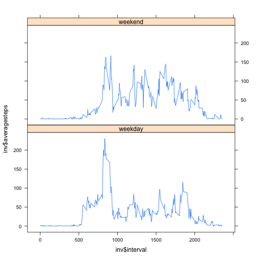

Activity Monitoring Data R Markdown file
=======================================

This is R Markdown file for Assignment 1

Loading the data


```r
setwd("~/Documents/my classes/Coursera/Reproducible Research/assignment 1")
activity <- read.csv("activity.csv",colClasses=c("numeric","Date","numeric"))
##define the type of each variables
```


Mean total number of steps taken per day

```r
activity2 <- na.omit(activity) ##ignore NA
datelist <- unique(activity2[,2]) ##the list of all dates
n <- length(datelist)
steps=NULL
k=1
for(i in 1:n){
  steps[k]<-sum(subset(activity2,activity2$date==datelist[i])[,1]) ##calculate the sum of steps per day
  k<-k+1
}
activity_sum<-data.frame(sumsteps=steps,date=datelist)
hist(activity_sum$sumsteps,xlab="total number of steps per day",main="total number of steps taken each day")
```

 

```r
mean(activity_sum[,1])
```

```
## [1] 10766
```

```r
median(activity_sum[,1])
```

```
## [1] 10765
```


The average daily activity pattern

```r
intervallist<-unique(activity2[,3]) ##the list of all time intervals taken
m<-length(intervallist)
aversteps=NULL
j=1
for(i in 1:m){
  aversteps[j]<-mean(subset(activity2,activity2$interval==intervallist[i])[,1]) ##calculate the average steps at each time interval
  j<-j+1
}
intervalaver<-data.frame(averagesteps=aversteps,interval=intervallist)
plot(intervalaver$interval,intervalaver$averagesteps,type="l",main="average number of steps of the 5-min interval",xlab="interval",ylab="average steps")
```

 

```r
max<-max(intervalaver$averagesteps) ##find the maximum value 
subset(intervalaver,intervalaver$averagesteps==max)[,2]
```

```
## [1] 835
```


Imputing missing values

```r
nrow(activity[!complete.cases(activity),]) ## total number of rows with NA
```

```
## [1] 2304
```

```r
nacase<-activity[!complete.cases(activity),]
row<-nrow(nacase)
for(i in 1:row){
  nacase[i,1]<-intervalaver[intervalaver$interval==nacase[i,3],1] ##fill in the NA values with the average steps at the time interval
  }
activity<-rbind(nacase,activity[complete.cases(activity),]) ## combine the refilled the data and the data without NA
datel <- unique(activity[,2]) ##the list of all dates
l <- length(datel)
step=NULL
q=1
for(i in 1:l){
  step[q]<-sum(subset(activity,activity$date==datel[i])[,1])
  q<-q+1
}
activitysum<-data.frame(stepsum=step,Date=datel)
hist(activitysum$stepsum,xlab="total number of steps per day",main="total number of steps taken each day")
```

 

```r
mean(activitysum[,1])
```

```
## [1] 10766
```

```r
median(activitysum[,1])
```

```
## [1] 10766
```
The values of steps are larger than the first part.The imputing data makes the sum of steps larger than the first one but the histogram shows the same trend.


The differences in activity patterns between weekdays and weekends

```r
activity$weektime<-as.factor(ifelse(weekdays(activity$date) %in% c("Saturday","Sunday"),"weekend","weekday")) ##add weektime column
weekday<-subset(activity,activity$weektime=="weekday")
inv_1<-unique(weekday[,3]) ##the list of all time intervals taken
step_1=NULL
a=1
for(i in 1:length(inv_1)){
  step_1[a]<-mean(subset(weekday,weekday$interval==inv_1[i])[,1])
  a<-a+1
}
invweekday<-data.frame(averagesteps=step_1,interval=inv_1) ##weekday
weekend<-subset(activity,activity$weektime=="weekend")
inv_2<-unique(weekend[,3]) ##the list of all time intervals taken
step_2=NULL
b=1
for(i in 1:length(inv_2)){
  step_2[i]<-mean(subset(weekend,weekend$interval==inv_2[i])[,1])
  b<-b+1
}
invweekend<-data.frame(averagesteps=step_2,interval=inv_2)
invweekday$weektime<-"weekday"
invweekend$weektime<-"weekend"
inv<-rbind(invweekday,invweekend)
inv$weektime<-factor(inv$weektime)
library(lattice)
xyplot(inv$averagesteps~inv$interval|weektime,data=inv,layout=c(1,2),type="l")
```

 


The end of the assignment
